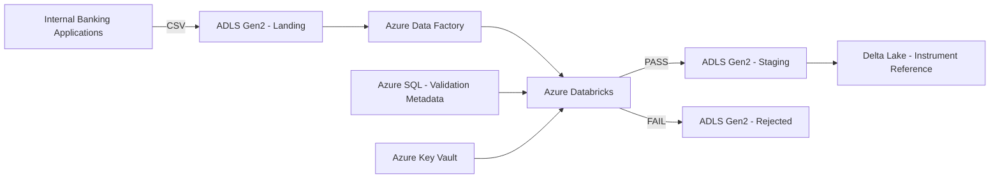

# Banking Instrument Reference Data Pipeline

> **Portfolio Disclaimer**
>
> This repository is a generalized and portfolio-safe representation of an enterprise banking data engineering use case. It contains no proprietary source code, client data, credentials, infrastructure configuration, or confidential implementation details.

## Overview

This project demonstrates an enterprise-style data engineering pipeline for validating and processing instrument reference data received from internal banking applications.

CSV files are landed into Azure Data Lake Storage Gen2 and processed using Azure Data Factory, Azure Databricks, PySpark, Azure SQL, Delta Lake and Azure Key Vault.

The pipeline performs file-level and data-level validation before allowing data into the curated Delta layer.

### Core validation rules

1. Reject the complete file when duplicate rows are detected.
2. Validate configured date fields against metadata stored in Azure SQL.
3. Move failed files to a rejected zone.
4. Move validated files to a staging zone.
5. Persist validated records as a Delta table.
6. Keep secrets out of source code.

## Architecture



## Processing flow

```text
Internal Applications
        |
        v
ADLS Gen2 / Landing
        |
        v
Azure Data Factory
        |
        v
Azure Databricks
        |
        +---- Duplicate validation
        |
        +---- Metadata-driven date validation
        |
        +---- PASS -----------------> Staging
        |                                |
        |                                v
        |                           Delta Table
        |
        +---- FAIL ----------------> Rejected
```

## Technology stack

| Area | Technology |
|---|---|
| Cloud | Microsoft Azure |
| Orchestration | Azure Data Factory |
| Storage | Azure Data Lake Storage Gen2 |
| Processing | Azure Databricks |
| Language | PySpark / Python |
| Table format | Delta Lake |
| Validation metadata | Azure SQL Database |
| Secret management | Azure Key Vault |
| Source format | CSV |
| Diagram | Mermaid |

## Repository structure

```text
banking-instrument-reference-data-pipeline/
|
├── README.md
├── .gitignore
├── architecture/
│   ├── architecture.md
│   └── architecture.mmd
├── adf/
│   ├── pipeline-design.md
│   └── pipeline-parameters.md
├── databricks/
│   ├── notebooks/
│   │   ├── 01_read_landing_file.py
│   │   ├── 02_validate_duplicates.py
│   │   ├── 03_validate_dates.py
│   │   ├── 04_process_valid_file.py
│   │   └── 05_write_delta_table.py
│   └── jobs/
│       └── job-config-example.json
├── sql/
│   ├── 01_create_schema.sql
│   ├── 02_create_validation_metadata.sql
│   └── 03_sample_metadata.sql
├── data/
│   ├── README.md
│   └── sample/
│       ├── instruments_valid.csv
│       ├── instruments_duplicate.csv
│       └── instruments_invalid_date.csv
├── config/
│   └── validation_rules.example.json
├── docs/
│   ├── business-requirement.md
│   ├── data-quality-rules.md
│   ├── processing-flow.md
│   └── engineering-decisions.md
└── tests/
    ├── test_duplicate_validation.py
    └── test_date_validation.py
```

## Data quality design

### Duplicate validation

The complete incoming record is checked for duplicates. If duplicate rows are found, the file receives a `REJECTED` status and is routed to the rejected zone.

### Metadata-driven date validation

Date validation rules are maintained outside the processing code.

Example:

| Column | Expected format |
|---|---|
| trade_date | yyyy-MM-dd |
| maturity_date | yyyy-MM-dd |
| settlement_date | yyyy-MM-dd |

This allows validation rules to change without rewriting the core validation framework.

## Target Delta table

The curated Delta table contains business attributes plus technical metadata:

```text
instrument_id
instrument_type
isin
trade_date
maturity_date
currency
source_file_name
ingestion_timestamp
validation_status
```

## Security

Secrets are intentionally excluded from this repository.

A production implementation should use Azure Key Vault and managed identities / secure secret references rather than hard-coded credentials.

Never commit passwords, access keys, service-principal secrets, personal access tokens, or private keys.

## Interview discussion points

This project can be used to discuss:

- Why separate landing, staging and rejected zones?
- Why use metadata-driven validation?
- Why use Azure SQL for validation metadata?
- Why use Databricks instead of doing all transformations in ADF?
- How would the design handle large files?
- How would you make the pipeline idempotent?
- How would you implement audit logging?
- How would you handle schema evolution?
- How would you implement CI/CD?
- How would you secure Azure SQL and ADLS access?
- How would you monitor failed files and retries?

This repository is intentionally designed as a generic banking reference-data use case and should be described as a portfolio-safe reconstruction rather than as a copy of any client implementation.
